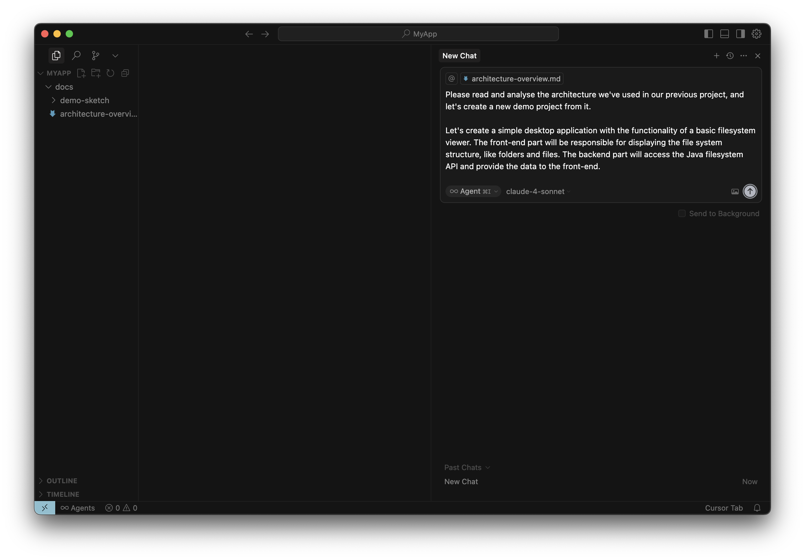
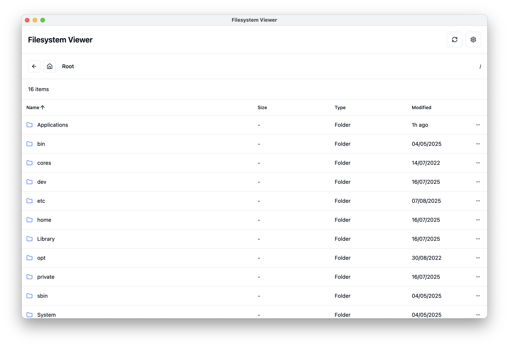

This setup allows you to scaffold your own Java desktop app with a React-based
UI. 

## Prerequisites

- Java 17 or higher
- [Node.js](https://nodejs.org/en/download) 20.11.0 or higher
- [Cursor](https://cursor.com/) 
- Claude 4 Sonnet 

## How to use

To try it yourself, download the [`docs`](docs) directory and put it into an
empty project.

Then add the `architecture-overview.md` document to the context for a new
project in Cursor, and ask the LLM to generate the app.



Here’s the prompt to use:

```markdown
Please read and analyse the architecture in architecture-overview.md we've used
in our previous project, and let's create a new demo project from it.

Let's create a simple desktop application with the functionality of a basic
filesystem viewer. The front-end part will be responsible for displaying the
file system structure, like folders and files. The backend part will access the
Java filesystem API and provide the data to the front-end.
```

## How to run

When all the project files are generated, you can start the app by first running
the Vite dev server:

```bash
cd web-app
npm run dev
```

Then, in another terminal, launch the application itself:

```bash
./gradlew run
```

You should see the desktop app window with Shadcn (React) UI that allows viewing
local files/folders and navigating through them:


